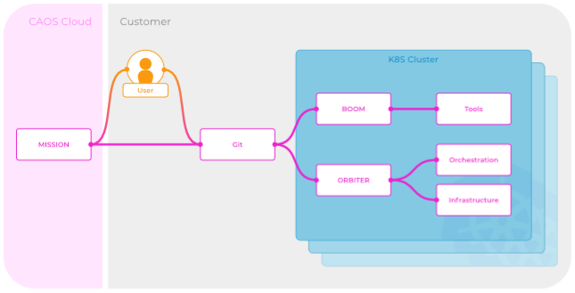

# ORBOS explained

## Design

We at CAOS believe that multicluster management, be it of Kubernetes, or any other clustered software, should be split into two equally important tasks. As with most critical systems an isolation of management (control-plane) and execution (data-plane) is vital to reduce the impact radius of misconfigurations and errors of a component.

Our recommendation for customers is to build several smaller clusters instead of a few big multitenant ones. This is, because we firmly believe that separation of concern can not be achieved without a complex management within one cluster. The additional overhead can be easily mitigated by utilizing reproducible processes. Treat clusters as cattle, not pets.

## Priciples

- Automate all executions of lifecycle operations
- Separate management and execution into loosely coupled processes
- Evade centralization
- Store all operations into the repository
- Utilize as few external dependencies as possible
- Reduce attack surface by...
  - not exposing APIs
  - automatically generating new secrets per cluster
  - encrypt secrets with trusted algorithms
- Build up on standards, don’t reinvent the wheel
- Be agnostic and open
- Optimize for day-two-operations

### Management

The management of all our components solely depends on a Git repository for storing the desired and current state. This greatly reduces the complexity of the overall system, as it has only a few moving parts. Furthermore, as long as the Git repositories data is available somewhere, disaster recovery and cluster duplication – e.g. to create new test environments – is possible at any time. Our customers can choose to use Git repositories of their liking to store and manage their clusters.

We host a web application called MISSION in order to enable customers to manage multiple clusters across different infrastructure-providers with a single pane of glass. MISSION does this by reading and writing to each cluster's Git repository. We think of MISSION as mission control to BOOM and ORBITER, hence the name.

### Execution

All components trusted with ensuring a desired state, BOOM and ORBITER, run decentralized in each customer's environment, be it private or public cloud. With this approach we achieve the greatest separation of the different clusters.

## Components

In this chapter we briefly describe all the components incorporated or used by ORBOS

### ORBITER

ORBITER is designed to operate all elements related to the infrastructure and orchestration layers. For example, a new cluster can simply be bootstrapped by locally running ORBCTL. When bootstrapping is done, an ORBITER running in the cluster continuously executes day 2 operations such as reconciling. Infrastructure providers and clustered software are abstracted, which means each clustered software can eventually run on each infrastructure provider.

- Currently supported clustered Software
  - Kubernetes
- Currently supported infrastructure Providers
  - Google Compute Engine
  - Static provider for on-prem scenarios
- Infrastructure Management
  - Software Versions
  - In- and outscaling of machines
  - Static Load Balancing
  - Managed Load Balancing
  - Network
  - Firewall
- Orchestration Management
  - Install, Configure and Update Kubernetes

### BOOM

BOOM is responsible for installing and maintaining a defined, integrated and tested set of tools (aka platform) on top of an orchestration system. The primary goal is to have the same platform available in each environment so that the software lifecycle is as reproducible as possible, but without restricting flexibility. Each tool can be disabled easily.
BOOM can be used in close conjunction with ORBITER but also standalone on any supported platform.

- Platform Management
  - API Gateway (Ambassador)
    - Cert Management (ACME)
    - Load Balancing
    - Reverseproxy
  - Observability
    - Logs (fluentbit, fluentd, loki, logging-operator)
    - Metrics (prometheus, prometheus-operator, prometheus-node-exporter, kube-state-metrics)
    - Dashboards (grafana)
      - Predefined dashboards for the components
  - Secrets (Gopass)
    - AES
    - GPG
  - Reconciling (ArgoCD)
  - Pre and Postapply of known Kubernetes-manifests
    - Kubernetes-native resources
    - CRDs(Argocd-applications, Logging-flows, Metric-monitors)
    
### Zitadel-Operator

The Zitadel-Operator is responsible for installing and maintaining all necessary components to run Zitadel on any available orchestration system. This components include the integration with BOOM and all provided tools, a database and everything networking related so that Zitadel is also available from outside, if necessary.

- Identity and Access Management
  - Configuration Management for Zitadel
  - Scalable and Cloud Native Database (CockroachDB)
    - Migrations from Release to Release
    - Setup through Zitadel itself
  - Networking (Cloudflare)
    - DNS entries
    - Firewall rules
    - TLS secure with "Origin CA certificates"
  - Backup and Restore
    - Periodically at fixed times, dates, or intervals run backups
    - Manually started instant backups
    - Manually started restore from backup

### MISSION

MISSION Control is designed to be a single pane of glass where multiple clusters, we call them ORBs, can be managed in one place.

- Manage multiple clusters
  - Configure BOOM and ORBITER with a GUI instead of editing yaml
- Notify users about…
  - updates of components
    - Kubernetes
    - BOOM
    - ORBITER
    - alerts and errors of their clusters (not their workload)
- Visualize clusters metrics (Dashboards)
- Recommend changes to cluster sizes or autoscale clusters

Currently MISSION is in a closed ALPHA

### ORB

An ORB represents a single cluster along with its Git repository. It can include ORBITER and/or BOOM.

### Git Repository

The repository is the single point of truth. Each operation of all components is stored here. It contains a desired and a current state. The desired state represents a user's desire to achieve a certain state. For example, “I would like to have kubernetes 1.18 installed”. On the other hand, the current state is a write back of ORBOS to represent how it sees the system's actual state.

Any Git Repository is usable as long as it supports SSH Keys.

### ORBCTL

The command line tool designed for human interaction with a particular ORB is called ORBCTL. It enables bootstrapping clusters with ORBITER, conveniently deploying BOOM into clusters, managing git repositories encrypted secrets, opening interactive shells on machines and provides more convenience functions.
