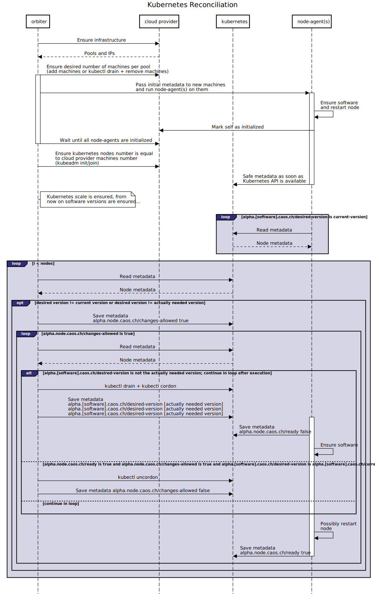

# Terminology

## Components

### Orb

The entirety of a system managed by `Orbos` as well as the information contained in a corresponding Git repository forms an `Orb`

### Git Repository

An `Orbs` Git repository contains all relevant information consumed and produced by `Orbos`. Namely it contains a `desired state`, a `current state` and `secrets`, all declared in yaml files.

#### Desired State

The `desired` state is the `Orbs` target state defined by humans. It holds all information the components of `Orbos` need to create the `current` state. All and only human interaction with the components of `Orbos` is manifested by changes to its corresponding `yml`-file.

#### Current State

The `current` state is the `Orbs` observed internal state. It is generated by the components of `Orbos` and edited only by for example `Orbiter` and `Node Agent`. A `Node Agent`s `desired` state is `current` state from the `Orbiter`s perspective, which is why it is embedded within the `current.yml` file. The `Node Agent` reports its `current` state in a dedicated `current` key next to its `desired` state (which in turn is declared in a `spec` key) within the `current.yml` file

#### Secrets

Keyed secrets are symmetrically encrypted with the AES 256 and encoded with the Base64 algorithms within the `yml`-files of the components.

### Orbctl

`Orbctl` is the command line tool for `Orbos` and contains all functions necessary to bootstrap and maintain an `Orb` from the local machine.

### Orbiter

`Orbiter` is released as a part of the container image named `orbos` and as a part of command line tool called `orbctl`. For bootstrapping a brand new `Orb`, the orbctl is invoked locally. It then provisions all `provider` infrastructure, installs `Node Agents` using SSH, installs the desired `clusters` and finally deploys an `Orbiter` to one of the new clusters (e.g. Kubernetes). The deployed Orbiter then takes over control from `orbctl` in order to continously ensuring the `Orbs` desired state.

### Node Agent

The `Orbiter` has the `Node Agents` reconciling software versions and configuration on operating systems (e.g. nginx from yum or apt). Therefore, each server has a responsible `Node Agent` run by `systemd`.

### Boom

`Boom` is released as part of the container image named `orbos` and is responsible for ensuring a defined toolset on an `Orb`.

### Zitadel-Operator

`Zitadel-Operator` is released as part of the container image named `orbos` and is responsible for ensuring all necessary components to run `Zitadel`

## Sequence

